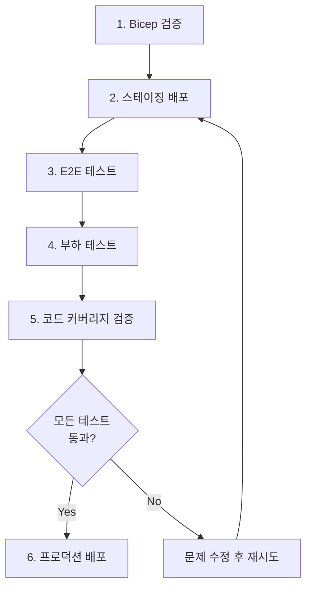

# MyStock Deployment Guide

이 문서는 MyStock 애플리케이션의 전체 배포 프로세스를 안내합니다.

## 목차

1. [사전 요구사항](#사전-요구사항)
2. [배포 프로세스 개요](#배포-프로세스-개요)
3. [단계별 배포 가이드](#단계별-배포-가이드)
4. [배포 후 검증](#배포-후-검증)
5. [문제 해결](#문제-해결)

---

## 사전 요구사항

### 필수 도구

```powershell
# Azure CLI 설치 확인
az --version

# Node.js 설치 확인 (v18 이상)
node --version
npm --version

# Python 설치 확인 (v3.11 이상)
python3 --version

# Artillery 설치 (부하 테스트용)
npm install -g artillery@latest

# PowerShell 7+ 권장
$PSVersionTable.PSVersion
```

### Azure 구독 준비

```powershell
# Azure 로그인
az login

# 올바른 구독 선택
az account list --output table
az account set --subscription "<subscription-id>"

# 구독 확인
az account show
```

### 필수 정보 준비

배포 전에 다음 정보를 준비하세요:

- ✅ Azure 구독 ID
- ✅ Alpha Vantage API 키 (무료: https://www.alphavantage.co/support/#api-key)
- ✅ JWT Secret Key (32자 이상의 랜덤 문자열)
- ✅ 배포 승인 권한

---

## 배포 프로세스 개요



---

## 단계별 배포 가이드

### 1단계: Bicep 템플릿 검증 (T192)

Bicep 템플릿이 Azure 모범 사례를 준수하는지 검증합니다.

```powershell
# 프로젝트 루트로 이동
cd C:\Work\Azure\test1\mystock3

# Bicep 빌드 및 검증
cd infrastructure/bicep
az bicep build --file main.bicep

# 구독 레벨 배포 검증
az deployment sub validate `
    --location koreacentral `
    --template-file main.bicep `
    --parameters environment=dev
```

**예상 결과:**
- ✅ `main.json` ARM 템플릿 생성됨
- ✅ 검증 오류 없음

**생성된 Bicep 모듈:**
- `monitoring.bicep` - Log Analytics + Application Insights
- `keyvault.bicep` - Azure Key Vault
- `database.bicep` - Cosmos DB (3개 컨테이너)
- `backend.bicep` - Container Apps
- `frontend.bicep` - Static Web Apps

---

### 2단계: 스테이징 환경 배포 (T193)

스테이징 환경에 전체 인프라를 배포합니다.

```powershell
# 스테이징 배포 스크립트 실행
cd C:\Work\Azure\test1\mystock3\infrastructure
.\deploy-staging.ps1 -Location koreacentral
```

**스크립트가 수행하는 작업:**

1. ✅ Bicep 템플릿 검증
2. ✅ Azure 인프라 배포 (Cosmos DB, Key Vault, Container Apps, Static Web Apps)
3. ✅ Cosmos DB 키 추출 및 Key Vault에 저장
4. ✅ JWT Secret 및 Alpha Vantage API 키 설정 (사용자 입력)
5. ✅ 백엔드 및 프론트엔드 빌드
6. ✅ 헬스 체크 수행
7. ✅ E2E 테스트 실행 (Playwright)

**사용자 입력 필요:**
```
JWT Secret Key (min 32 chars): ********************************
Alpha Vantage API Key: ****************
```

**배포 완료 후 출력 예시:**
```
=== Deployment Complete ===
Environment: Staging
Backend URL: https://mystock-staging-api-abc123.azurecontainerapps.io
Frontend URL: https://mystock-staging-web-abc123.azurestaticapps.net

Next steps:
1. Test the application manually at: https://mystock-staging-web-abc123.azurestaticapps.net
2. Monitor logs in Application Insights
3. Review deployment in Azure Portal
```

**배포 정보 저장 위치:**
- `infrastructure/deployment-output.json`
- `infrastructure/last-deployment.json`

---

### 3단계: E2E 테스트 실행

스테이징 배포 스크립트가 자동으로 E2E 테스트를 실행합니다. 수동 실행이 필요한 경우:

```powershell
cd C:\Work\Azure\test1\mystock3\frontend

# 환경 변수 설정
$env:PLAYWRIGHT_BASE_URL = "https://mystock-staging-web-abc123.azurestaticapps.net"

# E2E 테스트 실행
npm run test:e2e

# UI 모드로 실행 (디버깅용)
npm run test:e2e:ui
```

**테스트 범위 (14개 시나리오):**
- ✅ 인증 (회원가입, 로그인)
- ✅ 관심종목 (추가, 삭제, 메모 편집, 순서 변경)
- ✅ 포트폴리오 (추가, 수정, 삭제, 카테고리 전환, 히트맵)
- ✅ 주식 검색 및 시세 조회
- ✅ UI 테스트 (다크모드, 메뉴 네비게이션)

**테스트 결과:**
- 보고서: `frontend/playwright-report/index.html`
- JUnit: `frontend/playwright-report/junit.xml`

---

### 4단계: 부하 테스트 (T194)

100명의 동시 사용자로 부하 테스트를 수행합니다.

```powershell
cd C:\Work\Azure\test1\mystock3\infrastructure

# 부하 테스트 실행
.\load-test.ps1 -TargetUrl "https://mystock-staging-api-abc123.azurecontainerapps.io"
```

**테스트 파라미터:**
- 동시 사용자: 100명
- 테스트 시간: 5분 (300초)
- 초당 도착률: 20 req/sec
- 시나리오 비율:
  - 10% 회원가입/로그인
  - 30% 관심종목 작업
  - 30% 포트폴리오 작업
  - 30% 주식 데이터 조회

**성능 요구사항:**
- ✅ P95 지연시간 < 200ms
- ✅ 오류율 < 1%

**테스트 결과:**
- JSON 보고서: `infrastructure/load-test-report.json`
- HTML 보고서: `infrastructure/load-test-report.html`

**결과 예시:**
```
Performance Summary:
  P95 Latency: 145 ms
  Error Rate: 0.23%
  Total Requests: 12500

✓ PASS: P95 latency (145 ms) is within 200ms requirement
✓ PASS: Error rate (0.23%) is within 1% threshold

=== All load test criteria passed ===
```

---

### 5단계: 코드 커버리지 검증 (T195)

백엔드와 프론트엔드의 코드 커버리지가 70% 이상인지 확인합니다.

```powershell
cd C:\Work\Azure\test1\mystock3\infrastructure

# 커버리지 검증 실행
.\verify-coverage.ps1 -MinimumCoverage 70
```

**검증 내용:**
1. 백엔드 (Python/pytest):
   - 테스트 실행: `pytest tests/ --cov=src`
   - 커버리지 보고서: HTML, JSON, 터미널
   
2. 프론트엔드 (TypeScript/Vitest):
   - 테스트 실행: `npm run test:unit -- --coverage`
   - 커버리지 보고서: HTML, JSON

**결과 예시:**
```
=== All coverage requirements met ===

Backend: 72.5%
Frontend: 75.3%

View detailed reports:
  Backend:  C:\Work\Azure\test1\mystock3\backend\coverage_html\index.html
  Frontend: C:\Work\Azure\test1\mystock3\frontend\coverage\index.html
```

---

### 6단계: 프로덕션 배포 (T196)

⚠️ **주의:** 프로덕션 배포는 모든 이전 단계가 성공한 후에만 진행하세요.

```powershell
cd C:\Work\Azure\test1\mystock3\infrastructure

# 프로덕션 배포 실행
.\deploy-production.ps1 `
    -Location koreacentral `
    -ApprovalCode "YOUR_APPROVAL_CODE"
```

**프로덕션 배포 체크리스트:**

배포 스크립트가 자동으로 확인:
- ✅ 스테이징 배포 완료 (`last-deployment.json` 존재)
- ✅ 부하 테스트 완료 (`load-test-report.json` 존재)
- ✅ 백엔드 커버리지 ≥70% (`backend/coverage.json` 존재)
- ✅ 프론트엔드 커버리지 ≥70% (`frontend/coverage/coverage-summary.json` 존재)

**승인 확인:**
```
⚠️  WARNING: This will deploy to PRODUCTION environment!

Are you sure you want to proceed? Type 'DEPLOY TO PRODUCTION' to confirm: 
```

**배포 절차:**
1. 사전 배포 체크리스트 확인
2. 현재 프로덕션 환경 백업 (존재하는 경우)
3. Bicep 템플릿 재검증
4. 프로덕션 인프라 배포
5. 프로덕션 시크릿 설정 (스테이징과 **다른** 값 사용)
6. 백엔드 애플리케이션 배포
7. 프론트엔드 애플리케이션 배포
8. 프로덕션 스모크 테스트
9. 모니터링 알림 설정

**프로덕션 환경 정보:**
```
=== Production Deployment Complete ===

Environment: Production
Backend URL: https://mystock-prod-api-xyz789.azurecontainerapps.io
Frontend URL: https://mystock-prod-web-xyz789.azurestaticapps.net

Immediate Actions Required:
1. ✓ Backend deployed - Monitor logs in Application Insights
2. ✓ Frontend deployed - Test user flows manually
3. ⚠️  Set up custom domain (if needed)
4. ⚠️  Configure monitoring alerts in Azure Portal
5. ⚠️  Update documentation with production URLs
6. ⚠️  Notify team and stakeholders
```

---

## 배포 후 검증

### 헬스 체크

```powershell
# 백엔드 헬스 체크
curl https://mystock-prod-api-xyz789.azurecontainerapps.io/health

# 예상 응답
# {
#   "status": "healthy",
#   "version": "1.0.0",
#   "environment": "production"
# }
```

### 수동 테스트

1. **회원가입 및 로그인**
   - https://mystock-prod-web-xyz789.azurestaticapps.net/register
   - 새 계정 생성 및 로그인 확인

2. **관심종목 추가**
   - 주식 검색 (예: "Apple")
   - 관심종목에 추가
   - 순서 변경 테스트

3. **포트폴리오 관리**
   - 보유 종목 추가
   - 히트맵 렌더링 확인 (<2초)
   - 카테고리 전환 테스트

4. **다크모드**
   - 다크모드 토글 (<0.3초)
   - 새로고침 후 설정 유지 확인

### 모니터링 확인

```powershell
# Application Insights 포털 열기
az monitor app-insights component show `
    --resource-group mystock-prod-rg `
    --app mystock-prod-ai-xyz789 `
    --query connectionString

# Azure Portal에서 확인할 항목:
# 1. 요청 응답 시간 (P95 <200ms)
# 2. 오류율 (<1%)
# 3. 사용 가능성 (>99.9%)
# 4. Cosmos DB RU 소비
# 5. Container Apps CPU/메모리
```

---

## 문제 해결

### 배포 실패

**증상:** Bicep 배포 중 오류 발생

```powershell
# 배포 로그 확인
az deployment sub show --name mystock-prod-20250113120000

# 실패한 리소스 확인
az deployment operation sub list `
    --name mystock-prod-20250113120000 `
    --query "[?properties.provisioningState=='Failed']"
```

**해결:**
1. 리소스 이름 충돌 확인 (resourceSuffix 변경)
2. 구독 할당량 확인 (Cosmos DB, Container Apps)
3. 롤백: `infrastructure/INCIDENTS.md` 참조

### E2E 테스트 실패

**증상:** Playwright 테스트 타임아웃

```powershell
# 실패한 테스트 재실행
npm run test:e2e -- --grep "실패한 테스트 이름"

# UI 모드로 디버깅
npm run test:e2e:ui
```

**해결:**
1. 네트워크 지연 확인 (timeout 증가)
2. 백엔드 헬스 체크 실행
3. Application Insights에서 오류 로그 확인

### 부하 테스트 실패

**증상:** P95 지연시간 >200ms 또는 오류율 >1%

**해결:**
1. Container Apps 스케일 설정 확인
   ```powershell
   az containerapp show `
       --name mystock-staging-api-abc123 `
       --resource-group mystock-staging-rg `
       --query properties.template.scale
   ```

2. Cosmos DB 인덱스 확인
   - `backend/INDEXING_STRATEGY.md` 참조
   - 복합 인덱스 적용 여부 확인

3. Alpha Vantage API 캐시 확인
   - Redis 또는 메모리 캐시 동작 확인
   - 캐시 히트율 모니터링

### 커버리지 부족

**증상:** 백엔드 또는 프론트엔드 커버리지 <70%

**해결:**
1. 커버리지 보고서 확인
   ```powershell
   # 백엔드
   cd backend
   python -m pytest tests/ --cov=src --cov-report=html
   # coverage_html/index.html 열기

   # 프론트엔드
   cd frontend
   npm run test:unit -- --coverage
   # coverage/index.html 열기
   ```

2. 미커버 코드 식별 및 테스트 추가
3. 통합 테스트 작성으로 커버리지 향상

---

## 추가 리소스

### 문서
- [RUNBOOK.md](./RUNBOOK.md) - 상세 운영 절차
- [INCIDENTS.md](./INCIDENTS.md) - 장애 대응 가이드
- [INDEXING_STRATEGY.md](../backend/INDEXING_STRATEGY.md) - Cosmos DB 최적화

### 모니터링 쿼리
- [queries.kql](./monitoring/queries.kql) - Log Analytics 쿼리
- [dashboard.json](./monitoring/dashboard.json) - Azure Dashboard 설정

### 스크립트
- `deploy-staging.ps1` - 스테이징 배포
- `deploy-production.ps1` - 프로덕션 배포
- `load-test.ps1` - 부하 테스트
- `verify-coverage.ps1` - 커버리지 검증

---

## 결론

이 가이드를 따라 MyStock 애플리케이션을 성공적으로 배포할 수 있습니다. 각 단계는 이전 단계의 성공을 전제로 하므로, **순서대로 진행**하는 것이 중요합니다.

문제가 발생하면 `infrastructure/INCIDENTS.md`를 참조하거나 팀에 문의하세요.

**배포 성공을 기원합니다! 🚀**
